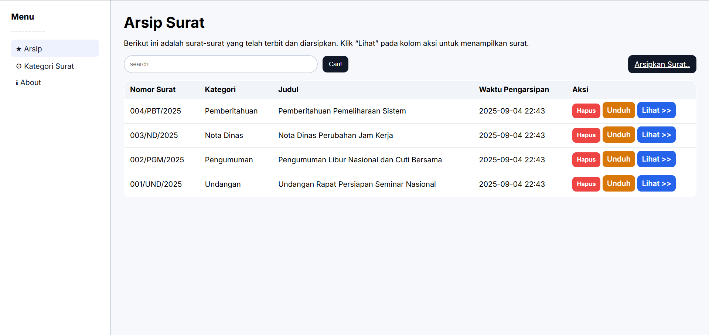
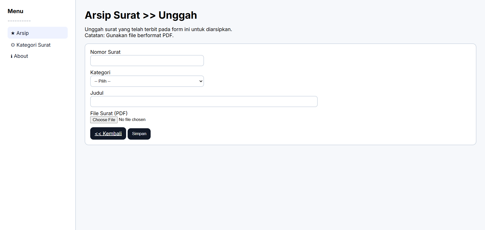
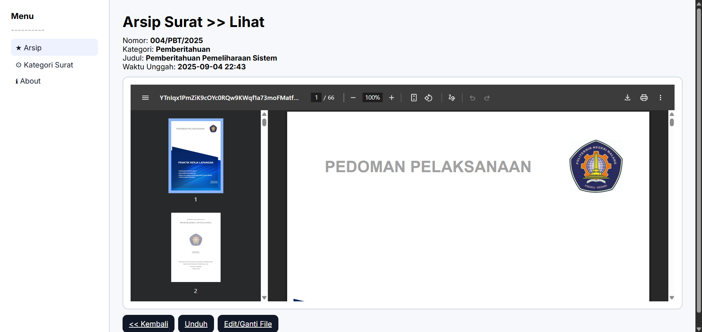
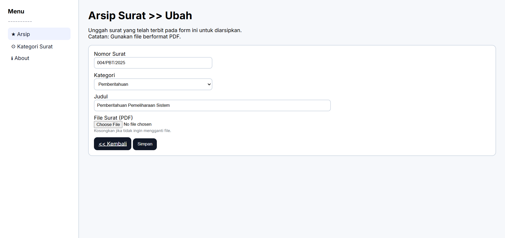
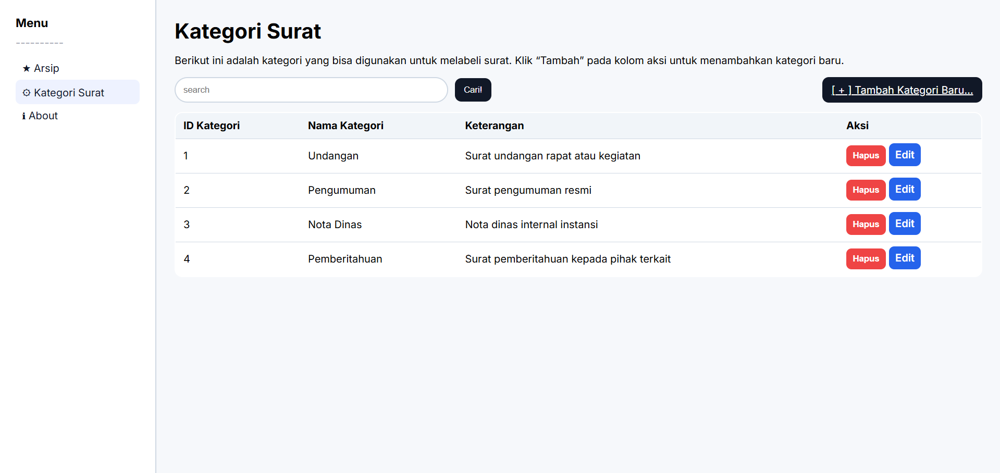
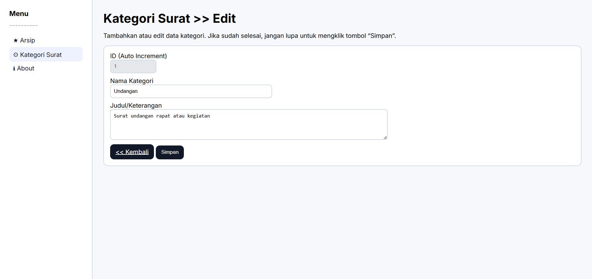
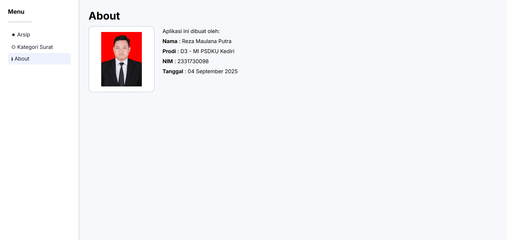

## Judul
**Aplikasi Arsip Surat Berbasis Web dengan Laravel**

---

## Tujuan
Aplikasi ini dibuat untuk membantu instansi atau organisasi dalam:
- Mengelola arsip surat masuk/keluar secara digital.
- Menyediakan akses cepat terhadap surat dengan fitur pencarian.
- Menyederhanakan pengelolaan kategori surat.
- Mengurangi penggunaan arsip fisik agar lebih efisien dan aman.

---

## Fitur
1. **Manajemen Arsip Surat**
   - Tambah arsip surat baru (unggah file PDF).
   - Edit arsip surat.
   - Hapus arsip dengan konfirmasi.
   - Lihat detail surat (preview PDF).
   - Download surat dalam format PDF.

2. **Pencarian Arsip**
   - Cari surat berdasarkan judul.

3. **Manajemen Kategori Surat**
   - Tambah kategori baru.
   - Edit kategori yang sudah ada.
   - Hapus kategori.
   - ID kategori otomatis.

4. **Halaman About**
   - Menampilkan foto, nama, NIM, dan tanggal pembuatan aplikasi.

5. **Validasi & Keamanan**
   - Upload file hanya mendukung PDF.
   - Konfirmasi sebelum hapus data.
   - Penyimpanan file aman di storage.

---

##  Cara Menjalankan
1. Clone repo:
   ```bash
   git clone https://github.com/rtpnlmazer/aplikasi_arsip.git
   cd aplikasi_arsip

2. Install dependency:
   ```bash
   composer install
   npm install && npm run build
   
3. Copy file .env.example menjadi .env, lalu atur konfigurasi database:
   ```makefile
   DB_DATABASE=aplikasi_arsip
   DB_USERNAME=root
   DB_PASSWORD=
   
4. Import database:
   ```bash
   mysql -u root -p aplikasi_arsip < database/aplikasi_arsip.sql
   
5. Generate key Laravel:
   ```bash
   php artisan key:generate
   
6. Jalankan server:
   ```bash
   php artisan serve
Akses di browser: http://localhost:8000

## Screenshots

### Halaman Arsip Surat


### Halaman Unggah Arsip Surat


### Halaman Lihat Arsip Surat


### Halaman Ubah Arsip Surat


### Halaman Kategori Surat


### Halaman Tambah Kategori Surat


### Halaman Edit Kategori Surat


### Halaman About

